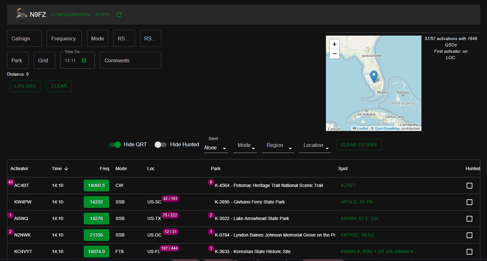
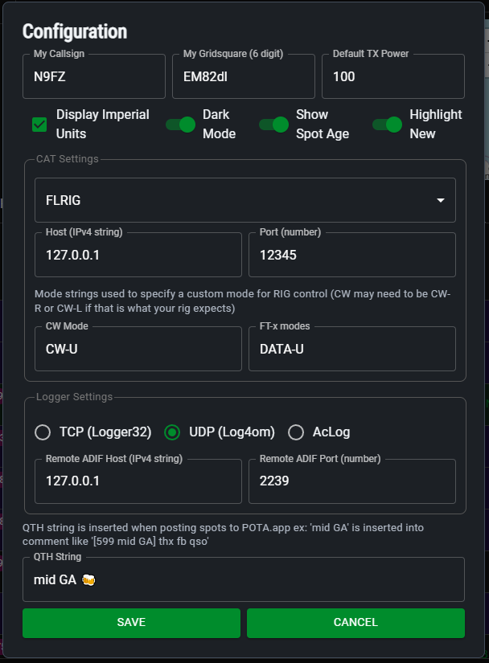
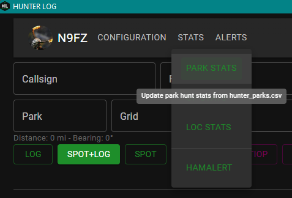

# Hunterlog 

    
    <h3 style="font-family: 'Segoe UI';margin-left:10px">A  POTA🌳 & SOTA🗻 hunter's best friend!</h3>
    

This application allows you to browse the current POTA and SOTA spots, QSY your rig via
CAT control, and log them to your master logger. It will also keep track of the references you have worked in an internal database. This allows you to know at a glance if a spot is for a reference you need to work.

This project is meant to be replacement for the excellent [potaplus](https://dwestbrook.net/projects/potaplus/) Chrome browser extension. If you have used that then this application should be very familiar.

## Features

* Quickly display and filter spots from POTA and SOTA
* Track hunted parks and summits
* Track QSO count with activators
* Log QSOs to your main logger via UDP or TCP connection
* Use CAT control to immediately jump to a spot
  * supports: FLRIG, RIGCTLD, and N3FJP's CAT API (more possible)

## Community

If you're not comfortable using Github to submit issues and enhancement requests, feel free to join our Discord community server. Hop in and ask questions, share comments, propose new features or get help using Hunterlog.

[Discord Invite Link](https://discord.gg/DfqMVMuMnG)

## Usage

To launch the application, run the executable in any folder. This will create the needed files.

This will launch the main window and then you need to perform the initial configuration.

You should notice is that the default configuration is for `N0CALL` callsign. You **must** change your callsign and gridsquare to your information. Click the `CONFIGURATION` button next to the callsign in the top left corner and input your callsign and your gridsquare. 

> [!NOTE]
> On Linux, you may have to `chmod +x` the executable file and run it via the terminal.

## Configuration

Let's take a look at the configuration options. 

> [!NOTE]
> The info in this section is just a introduction. For an in-depth guide please see the [Users Guide](docs/USER_GUIDE.md).

*My Callsign* and *My Gridsquare* are your base callsign and home QTH 6 digit Maidenhead gridsquare. Your call should also be what your POTA user account is registered as. 

### CAT settings 
First is a drop down selection of CAT interface types. 
* FLRIG
* RIGCTLD
* ACLOG (this is N3FJP's logger)

Host and Port are the two needed values are the remote endpoint of the CAT control instance that's running.
* If CAT control is on the same computer the remote host is 127.0.0.1
* The default FLRIG port is 12345. 

The modes strings are for setting specific modes if your rig needs something
besides CW for setting CW mode (like CW-R) or something besides USB for FT-x modes.

### Logger settings

The logger settings includes radio buttons for the logger type:

* **TCP**  to use a TCP socket (a la Logger32) 
* **UDP** to use a UDP socket (a la Log4OM). 
* **AcLog** if you use N3FJP's AcLog as it has special requirements for the data.

Remote ADIF Host and port:

The remote IP address and port where the logger is currently running. This computer should have the logging program open.

> If the logger is on the same computer the remote host is `127.0.0.1`.
> The port can usually be configured with in the logger program. See your loggers
> documentation for specifics

### QTH string

When spotting on the POTA network the RST you put in the QSO entry is added to your spot comment. This string is appended directly after the RST sent with a whitespace before it.

If you put in `South TX` for QTH string and you Spot or Spot & Log a station with a Sent
RST of 57, it will post a spot to the POTA network with a comment like this:

> [57 South TX]

## Stats

> [!IMPORTANT]
> 👉 **For more in-depth instructions on importing stats** [See the STAT guide](docs/STATS.md) 👈
> 
> Really! Go read that guide. It will show you how to do this step-by-step.

When you first run HunterLog it has no way to access your existing POTA park
hunts. But I've provided a way to load in your existing hunter stats so you can
get the most out of the logger. 

If you want to load in your existing hunter stats you need to update your stats using the `STATS` menu. There are three options here: 

The most important one is the PARK STATS. You will want that to import that so
you can see what parks you need to hunt. 
**Importing the park stats can take a long time** so go read the STATS guide

> [!WARNING]
>*STATISTICAL DATA SHOWN IN THIS APP IS NOT AUTHORITATIVE* The authoritative data
of record is your data in https://pota.app

### Logging QSOs

Click a spot to load the QSO info into the top portion of the screen. Click green frequency button to QSY with CAT control. Click Log QSO after you've had the contact. The app will update stats and send the QSO data (with any modifications you do to the input) to your main logger. 

*It also will store a copy locally in hunter.adi as well as in the database.* This
is for your convenience and I'd hate for anyone to lose a QSO.

### Spotting

You can spot/re-spot POTA activators through Hunterlog. When this is done the 
`RST Sent` and `COMMENT` QSO field are used to build the spot comment. Other
posted spot info also comes from the QSO entry fields: Frequency, Callsign, and Mode.
These will be sent to the POTA website and everyone will be able to see them.

## Files

Running the app will create the `spots.db` which is very important as it will 
contain all your qsos, configuration settings and stats such as parks and 
locations. You should back up this file occasionally and back it up before upgrading
to newer versions of Hunterlog.

The file `index.log` is the application's log file. It is not the same as the 
Javascript console that maybe seen when inspecting the webpage.

`hunter.adi` is a backup store of logged QSOs, if there's an error with the network
connection between HunterLog and your main logger. Your QSOs are here still.

## Bug reporting

This app is currently under pre-release. Please report bugs here on Github 
issues. In your report, please include both the app version number and the db
version number. Both are displayed at the very bottom of Hunterlog.

*Happy hunting and hpe to CUL 🍻 es 73*
\- Cainan N9FZ
