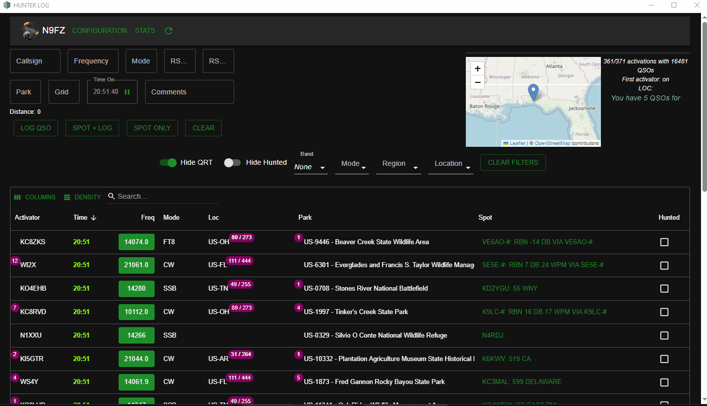

# Hunterlog

*THIS IS NOT YOUR MAIN LOGGING PROGRAM!*

This is a replacement for the excellent [potaplus](https://dwestbrook.net/projects/potaplus/) Chrome browser extension. If you have used that then this application
should be very familiar.

This application allows you to browse the current POTA spots, QSY your rig via
FLRIG, and log them to your logger through a remote ADIF message.

## Download

Hunterlog is currently in pre-release and any releases are not immediately obvious
where the should be downloaded from. Here is a link to the latest release:

Release page [v0.0.1L](https://github.com/cwhelchel/hunterlog/releases/tag/v0.0.1l)

[Windows Download](https://github.com/cwhelchel/hunterlog/releases/download/v0.0.1l/hunterlog_0.0.1L.zip)

[Ubuntu Download](https://github.com/cwhelchel/hunterlog/releases/download/v0.0.1l/hunterlog-ubuntu_0.0.1L.zip)

## Usage

On Windows, run the executable in any folder. 

On Linux, you may have to `chmod +777` the executable file and run it via the terminal.

The very first thing you should notice is that the default configuration is for 
W1AW. You probably aren't the ghost of Hiram Percy Maxim, so you should change
your callsign. Click the `CONFIGURATION` button next to the callsign and input
your callsign and your gridsquare. 

### Configuration

Let's look at the configuration options.

Default TX Power is used in logging. Put over legal limit if you want.

FLRIG Host IP and Port:

The app uses FLRIG to handle CAT control. These two values are the remote 
endpoint of the FLRIG instance that's running. The default FLRIG port is 12345

The radio buttons are for the logger. Select Default or Log4om to send the basic
ADIF data to a remote logger. Select AClog if you use AcLog as it has to have
the data wrapped in a different command. (Default and Log4om do the same thing currently)

Remote ADIF Host and port:

The remote endpoint data to send logged QSOs. Should be running Log4om or AClog
or any other logger that accepts raw ADIF over UDP connections.

Click save to store the changes. Then click the refresh button on the main 
screen to see your callsign and your configured Gravatar. You have a POTA 
account right?

### Stats

If you want to see your some nice stats like the POTAPlus addon, you need to
update your stats using the `STATS` menu. There are three options here.

**STATISTICAL DATA SHOWN IN THIS APP IS NOT AUTHORITATIVE** The authoritative data
of record is your data in https://pota.app

#### PARK STATS
This is useful to show what parks you have hunted and how many times you've hunted
them.

You must to visit [https://pota.app/#stats/](https://pota.app/#/user/stats) and use the Hunted Parks "Export CSV" button to download the `hunter_parks.csv` file.

Click the `PARK STATS` button, select your csv file, and wait for several minutes.
This operation takes a long time as park data must be downloaded and stored in 
the local `spots.db` database.

This does take a long time, so there are export links at the bottom of the app
so this data can be backed up.

#### OP STATS
This is an import of an ADIF copy of your 'main' log file. Your QSOs should have 
the ADIF fields set as so:
- SIG set to 'POTA'
- SIG_INFO set to the park reference
- COMMENT like the POTAPLUS comment ex: `[POTA K-4451 US-AL EM72el Tuskegee National Forest]`

The import will try it's best to match the park and will worst case parse the POTAPlus
comment. *This data is not used for Park hunt counts but only for Operator hunt counts.*

#### LOC STATS
Downloads and imports the locations data from the POTA website and stores them
locally. No hunter data is in this file but the meta-data about locations and 
prefixes is used to tabulate the parks hunted within a location. Ie you have 
worked 78/224 in US-GA.

### Logging QSOs

Click a spot to load the QSO info into the top portion of the screen. Click green frequency button to QSY with CAT control. Click Log QSO after you've had the contact. The app will update stats and send the QSO data (with any modifications you do to the input) to your main logger. 

*It also will store a copy locally in hunter.adi as well as in the database.* This
is for your convenience.

### Spotting

You can now spot/re-spot activators through Hunterlog. When this is done the 
`RST Sent` and `COMMENT` QSO field are used to build the spot comment. Other
posted spot info also comes from the QSO entry fields: Frequency, Callsign, and Mode.
These will be sent to the POTA website and everyone will be able to see them.

## Files

Running the app will create the `spots.db` which is very important as it will 
contain all your qsos, configuration settings and stats such as parks and 
locations. You should back up this file occasionally and back it up before upgrading
to newer versions of Hunterlog.

The file `index.log` is the application's log file. It is not the same as the 
Javascript console that maybe seen when inspecting the webpage.

## Bug reporting

This app is currently under pre-release. Please report bugs here on Github 
issues. In your report, please include both the app version number and the db
version number. Both are displayed at the very bottom of Hunterlog.

\- Cainan N9FZ