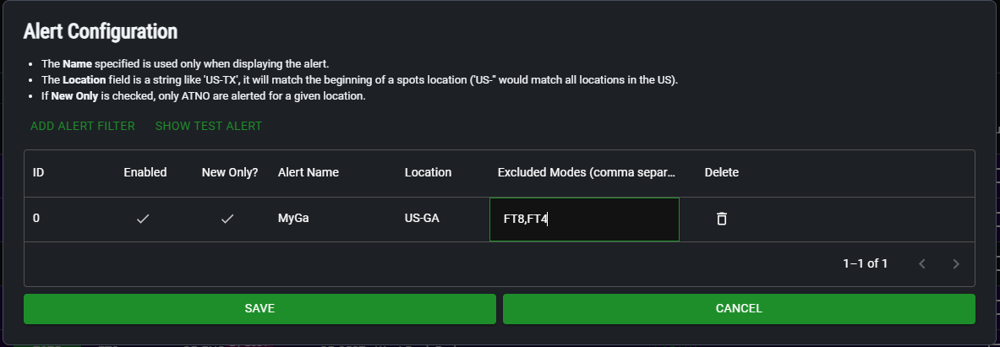
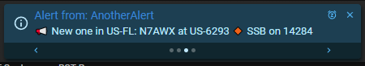

# Alerts Guide

The Alerts system in HunterLog is intended to show a popup for parks for a 
given location even if you have filtered out the main spots row. This is helpful
if you want to work a spot on a mode that you currently aren't looing at on the
spot viewer. *I'm usually looking at CW spots but I want do want to know when a new 
park in GA is on SSB*

The configuration is pretty straight forward. On the Alerts screen, click 
`Add Alert Filter` button and click on the cells to edit the values. The location
is the most important piece of information to set.

In this screenshot, I have an alert for New Only (a reference I haven't hunted)
in US-GA (a POTA location). I've given it the name MyGa, which will be displayed
on the popup. I also want to exclude FT8 and FT4.

If a park is spotted that meets the alert criteria a popup appears in the main
menu area that looks like this:

There are a few controls to note on this alert. First, if there are multiple alerts
that are displayed, the dots and arrows along the bottom allow you to click forward
and backwards to see them all. Secondly, the `X` button and `Snooze` button allow you 
to remove/hide the alert. 

The `X` button is a temporary dismissal, the alert will appear again at the next spot
refresh (1 minute). If you wish to quickly close ALL alerts you can hold Shift and 
click the X button.

The `Snooze` button will allow you to snooze that particular alert for 10 minutes.
In the above example, all alerts from 'AnotherAlert' (which is setup for US-FL)
would be hidden for 10 minutes.
