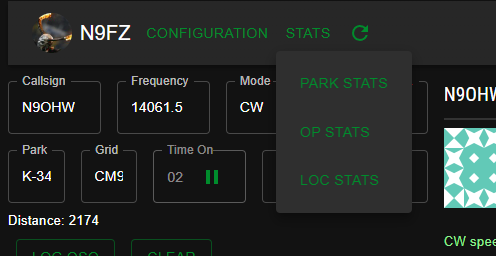

# Importing Your Stats

One of the most important features of hunterlog is its ability to show you what
park you hunted, what operator you have hunted, and how many parks you have 
hunted for a given location.

_To have the best possible experience_, you should load in some of your historical
data. 

If you don't load in your historical data, hunterlog will track these stats as
you use the app. But they will be from a starting point of 0.

**STATISTICAL DATA SHOWN IN THIS APP IS NOT AUTHORITATIVE** The authoritative system
of record is https://pota.app. The data there is golden. The data in hunterlog
is just a nicety. 

## Importing Stats

All this is done through the buttons in the STATS menu:

*✏️ Note: Each import task will display a spinning circle indicating that it's working.*

## PARK STATS

This probably the single most useful thing to import and it also ***takes the longest amount of time***.

Once imported the park stats will allow hunter log to show you what parks you have hunted and how many times you've hunted them. More importantly it shows you what 
parks you _haven't_ hunted.

### Step 1 - Download hunter_parks.csv

You must to visit [https://pota.app/#stats/](https://pota.app/#/user/stats) and use the Hunted Parks "Export CSV" button to download the `hunter_parks.csv` file.

Once that file is downloaded, proceed to the next step.

### Step 2 - Load file into hunterlog

Click the `PARK STATS` button, select your csv file, and wait for several minutes.
This operation takes a long time as park data must be downloaded and stored in 
the local `spots.db` database. 

This operation could take upwards of 5 - 10 minutes depending on how many parks
you have hunted. 

> If something happens during this process, *don't worry*.
> 
> You can restart the app and import again and it will continue where 
> it left off. It downloads and commits park data for each park as it gets 
> it.

As the import progresses, you will see badges showing up on the spot viewer for the parks you have worked. (Well, if there are any in the current spot list).

If you re-download your `hunter_parks.csv` and re-import it will reset your park hunt counts to whatever is in the csv without having to download the Park data.

Also, as you hunt parks and use the app more parks get added. 

#### Backing Up Park Data
Since this _should_ be a one time process and since it takes _so long_, I added the ability to export and import previously loaded in Park data. At the bottom of the app there are links to export and restore the park data to hunterlog.

## OPEARTOR STATS

This will display how many QSOs you have had with a given callsign at a POTA 
park activation. This is marginally useful given that the counts will be off
from what the POTA website has because of how "two-fer" parks are counted.

To load up historical data for this stat, an ADIF copy of your 'main' log file 
is needed. Your QSOs should have the ADIF fields set as so:
- SIG set to 'POTA'
- SIG_INFO set to the park reference
- COMMENT like the POTAPLUS comment ex: `[POTA K-4451 US-AL EM72el Tuskegee National Forest]`

The import will try it's best to match the park and will worst case parse the POTAPlus
comment. *This data is not used for Park hunt counts but only for Operator hunt counts.*

_Note_: if you are like me and only log one QSO with an activator even if they are
at a two-fer park, then the operator hunt numbers will not match with POTA.APP

### Step 1 - Export you master log to ADIF

This is up to you to know how to do. Every logging app is different. It is also
up to you is to have the correct ADIF fields in the file (SIG, SIG_INFO) as 
described above.

Once you have this adi file, proceed to the next step.

### Step 2 - Load file into hunterlog

Like the park stats, click the button and find the file. Fortunately this should
take very little time as it does not have to download anything from the POTA 
website.

After it's loaded you should see number badges showing how many QSOs you have
had with specific activators.

## LOC STATS

Downloads and imports the locations data from the POTA website and stores them
locally. No hunter data is in this file but the meta-data about locations and 
prefixes is used to tabulate the parks hunted within a location.

This is the easiest data to import and should take very little time.
