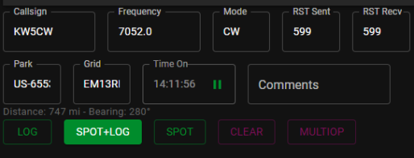

# Hunterlog User Guide

## Main Menu

At the very top of the application is the main menu. Your callsign and Gravatar
are displayed here. There are three buttons, CONFIGURATION, STATS, ALERTS, and 
a Refresh button. 

Configuration is described below. The Refresh button is like hitting F5
on your browser. It doesn't necessarily refresh the spots from POTA.

The STATS menu has a few sub-menu items for loading data from various sources.

- PARK Stats: downloaded from pota website. hunter_parks.csv
- OP Stats: import of a adif log containing hunts of activator callsigns
- LOC Stats: download from pota website. program/location data
- HAMALERT: gives a list of unhunted parks in a location (state)

These are described in detail in the [Stats Guide](STATS.md). But they will have a progress indicator that will disappear when they are done processing as some of these operations take a long time.

The ALERTS menu allows you to configure alerts that will popup on the main menu
bar to notify you of parks you may want to hunt. It's described in [Alerts Guide](ALERTS.md)

## QSO Entry

When a row is clicked in the [spot viewer](#spot-viewer), the QSO entry fields in the top-left are populated with data from the activation. The basic info is all copied: callsign, frequency, mode. A default RST is given (59 for voice, 599 for CW, etc). 

> [!NOTE]
> Frequency should be entered in kilohertz (kHz)

The text fields for the QSO entry are editable. What is input into those fields
is what will be logged. You can also stop the QSO timer and input your own time. 

These boxes can be filled out manually as well. This is most likely when you hear
an activator calling out but there is no spot in the system. When entering a callsign
or reference manually, when you leave the text box a lookup will be performed for 
the activator call or reference. The data described in the next sections will be
filled out as normal.

> [!TIP]
> Manual entry is a good way to quickly check your stats for a reference or bring up
> the QRZ page of a callsign (if they have a POTA profile)

### QSO Entry Buttons

- LOG: logs a hunt to the HL database and your logger (does not spot)
- SPOT+LOG: logs like LOG but also posts a spot to the POTA website
- SPOT: posts an activator's info to the POTA website
  - see [Posting Spots](#posting-spots).
- CLEAR: reset the QSO entry text boxes (and the other data sections)
- MULTIOP: allows logging of activations with multiple operators
  - see [Multiop Logging](#multiop-logging).

Just below the buttons, the distance and bearing to the reference are shown.

### Posting Spots

The SPOT+LOG and 'SPOT' button allows you to post spots and re-spots of activators directly to the POTA website. Most of the data for the spot/re-spot is taken from the values entered into the QSO entry data.

> [!NOTE]
> Sorry, SOTA spotting and re-spotting is not yet supported

When spotting on the POTA network, the data entered into `RST Sent` is added to your spot comment. The `QTH String` the you setup in the configuration screen is also used in
this spot comment (directly after the RST sent).

If you put in **South TX** for `QTH string` and you Spot or Spot & Log a station with a 
`RST Sent` of 57, it will post a spot to the POTA network with a comment like this:

> [57 South TX]

If you put in notes into the QSO `Comments` text box, they will be appended to 
the above spot comment string. This is so you can leave a message to other hunters
or the activator. 

Extending the above example from South TX, if you put in *👍 good job on first activation*
into the `Comments` box the spot comment will show on the POTA website like this:

> [57 South TX] 👍 good job on first activation

### Multiop Logging

It can be quite common to hear multiple operator activating the same reference.
HunterLog supports creating multiple QSO log entries where the difference is the
other operators callsigns (and a slight time difference).

If hunting a spot (via clicking through the spot rows) you may see the 'Other OPS'
box appear with data automatically filled out. HunterLog will look through the POTA
spot comments and can find spots posted by POTAPlus or HunterLog with a format for
multiop activations. This formatted data provides the other callsigns.

Of course, this depends on if someone has re-spotted them with the correctly
formatted spot comment (the format is like this `{With: N9FZ,W1AW}`).

If it does not pull up the other operators into the MULTIOP mode automatically, 
you can enter them manually. Click the `MULTIOP` button and enter in the 
callsigns of the other operators (Don't repeat the call that's in the Callsign
QSO entry text box).

> [!NOTE]
> The spot viewer does not refresh the logged multiop spot in the same way as 
> when logging a single operator. It will send however many QSOs to your 
> logger, but there will be a little delay as to not overload your logger's 
> connection.

### Logging SOTA chases

Currently, HunterLog does not support logging chases directly to [sotadata](https://www.sotadata.org.uk/).
However, HunterLog still provides tracking of worked SOTA summits and SOTA activators the same way as POTA parks.

> [!TIP]
> The best way I've found to log chases is to find the current spot on [sotawatch](https://sotawatch.sota.org.uk/) and click the 'Log Spot' button.

## Activator Info
When a row is clicked in the spot viewer, the Activator's stats, comments, CW speed
and a few helpful buttons, are displayed in the top-middle section.

The activators callsign, name, and other POTA data are pulled from the POTA web
service (SOTA not supported yet). It also shows how many QSOs you have had with
this activator.

If spot comments are available they will be parsed and the Activators own comments
listed in order from oldest to newest. If the spot is CW, it will show the CW
speed in WPM from the RBN spot.

There are few buttons available next to the activators name. There are listed 
in order (left to right):
- Copy Spot as Markdown
  - a Markdown formatted snippet (use it to share in Discord)
- Copy Spot as Text
  - copy spot as text ex: `KO4WTM -- CW (7062) @ park K-TEST`
- QRZ: open the activators QRZ.com page
- RBN/PSK: (CW and FTx) Open the skimmer page for the activator's callsign

## Reference (Park/Summit) Info

When a row is clicked in the spot viewer, the top-right side section displays a map with the reference location and some data about the reference.

The reference string and title are displayed first. The title is also a link to
the website for either the Park or Summit. The displayed reference data is a
different between parks and summits but either are self explanatory. The
text at the bottom shows the number of QSOs you've had with that reference.

## Configuration

Clicking the `CONFIGURATION` button on the main menu will allow you to change
the options described here. When clicked this modal dialog will be displayed:

- My Callsign: your callsign. This is what will be logged to your logger
  - if a POTA account is associated with the call, it will use the Gravatar image also
- My Girdsquare: your 6 digit maidenhead gridsquare locator. 
  - Used in logging and distance & bearing calculations
- Default TX Power: TX power. this is a holdover from potaplus.
- Display Imperial Units: feet or meters
- Dark mode: toggle between light and dark mode
- Show Spot Age: if selected shows spot time as an age: '2 MIN' vs the '12:34'
- Highlight New: if a park is new, pulse the color of the spot row

### CAT settings 
First is a drop down selection of CAT interface types. Currently those
are FLRIG, RIGCTLD, and ACLOG (hopefully more will be added).

`Host` is the remote IP address of the computer where the CAT control software is running.
`Port` is the port number that the CAT control software expects (this usually can be configured in the CAT control software)

* If CAT control is on the same computer as HunterLog, the host is 127.0.0.1
* The default FLRIG port is 12345

The modes strings are for setting specific modes if your rig needs something
besides CW for setting CW mode (like CW-R) or something besides USB for FT-x 
modes. This will be dependant on your rig and what it wants. My IC7300 expects
'CW' for the mode but I think Yaesu rigs might want 'CW-R' or 'CW-L'.

> [!TIP]
> FLRIG is probably the best choice for CAT control for the general population.
> It's free and open source and runs on multiple platforms. However, it can be
> *particular*, I've had problems using the latest with my ic7300 and have since
> settled on using FLRIG version `2.0.01`

### Logger settings

The logger settings includes radio buttons for the logger type. Select **TCP**  to use a TCP socket (a la Logger32) or **UDP** to use a UDP socket (a la Log4OM). These two both send raw ADIF data to the remote endpoint. 

Select **AcLog** if you use N3FJP's AcLog as it has special requirements for the data.

#### Remote ADIF Host and port

These values are the remote endpoint of the computer running your main logging software. The computer should be running (it should be actively open) Logger32, Log4om, AClog, or any other logger that accepts ADIF over network connections. *The computer can be the same computer that HunterLog is running on.*

`Remote ADIF Host` is the IP address of the computer where the logger software is running.
`Remote ADIF Port` is the port number that the logger software expects (this usually can be configured in the logger) *The default ACLOG port is 1100*

Like the CAT control, if the logger software is on the same computer as HunterLog
the remote host should be `127.0.0.1`

> [!TIP]
> Consult your main logger's documentation on how to configure it to accept ADIF style
QSOs over a network connection. Then use that information to configure HunterLog. The main
piece of information to track is the port number.

### Saving

Click save to store the changes. Then click the refresh button on the main 
screen to see your callsign and your configured Gravatar. You have a POTA 
account right?

## Filter bar

Directly below the upper area of the HunterLog window is the filter bar. Settings
selected here are saved across executions of HunterLog.

* Hide QRT: show or hide POTA spots marked QRT
* Hide Hunted: show or hide current activations that you have worked
* Only New: if set, show only parks and summits you have never worked

There are a few filtering options that should be self-explanatory. However,
not all Bands are represented and not all modes are available to filter by.

The region and Location dropdowns have options that are built from the current
spots.

SIG (Special Interest Group) can be POTA, SOTA, or None.

The Clear button will reset all the filters to their default state (Hide QRT 
default state is 'on').

## Spot Viewer

The lower section of the screen has a table of current POTA spots from the POTA
application page. If you use table mode on the POTA website, then this should be
familiar.

### Quick Filter bar

This overlooked bar is provides a few features. The most useful is probably
the *Search* box which will filter the spots by the text you enter. Usually the
callsign, but other data is search as well.

*Density* allows you to change how compact the spot table is. And *Columns* allows
you to show or hide individual columns.

### Spots table

This is the meat of the application. It shows the normal POTA activation spot 
info, a green QSY button that shows the frequency, a clickable spot comment 
section, and the hunted flag.

Clicking anywhere on the row will populate the QSO entry fields at the top of
the application's screen.

Clicking the Green button with the spot frequency will command FLRIG to QSY your
radio via CAT commands to that given frequency and mode.

The numbers badge that appears near the callsign indicates how many QSOs you have
had with activators callsign. This is only available if your ADIF log is imported correctly in the `STATS` menu via `OP STATS` button.

The number badge that appears near locations indicates how many parks you have hunted
out of the number of parks at that location. This is only available if you load
the parks and locations from the `STATS` menu.

Lastly, the number badge next to the park reference and name indicates how many
QSOs you have had with activators at that park. It is not there for parks that 
you have not hunted. This is only available if you load the parks data from the
`STATS` menu.

Clicking the green text of the most recent spot comment will open up a dialog 
with all spot comments.

## Footer

The bottom of the screen has a few more items. On the right are some page controls
for the spot viewer. You can select the number of spots per page and use the
arrows to move through the spot pages.

On the bottom left there are a few seldom used items.

Most important here is the version numbers. This shows the overall application 
version as well as the current database schema version.

Next to the version are a few buttons for administrative tasks:

* Export Logged QSOs: this will let you save all the QSOs from the spots.db into a file
  * The adi file is named {timestamp}_export.adi
* Export Park Info: will export the known parks from spots.db into a file
  * file is named park_export.json
  * use this file with the next button
* Import Park Info: load in park_export.json into the spots.db