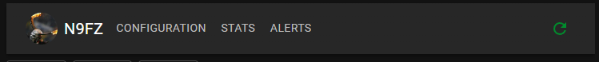

# Hunterlog User Guide

## Main Menu

At the very top of the application is the main menu. Your callsign and Gravatar
are displayed here. There are three buttons, CONFIGURATION, STATS, and a Refresh
button. Configuration is described below. The Refresh button is like hitting F5
on your browser. It doesn't necessarily refresh the spots from POTA.

The STATS menu has a few sub-menu items for loading data from various sources.

- PARK Stats: downloaded from pota website. hunter_parks.csv
- OP Stats: import of a adif log containing hunts of activator callsigns
- LOC Stats: download from pota website. program/location data

These are described in detail later. But they will have a progress indicator that
will disappear when they are done processing. Some of these operations take a long
time.

It may be necessary to restart the application after the data is loaded in order
to see the effects.

## QSO Entry

When a row is clicked in the spot viewer, the QSO entry fields are populated with
data from the activation, the Activator's stats, comments, CW speed are displayed
in the middle section, and the right side section displays a map with the parks
location and some data about the park.

The text fields for the QSO entry are editable and what is input into those fields
is what will be logged. You can also stop the QSO timer and input your own time.

If spot comments are available they will be parsed and the Activators own comments
listed in order from oldest to newest. It will also list out the CW speed in WPM
if available.

## Configuration

Clicking the `CONFIGURATION` button on the main menu will allow you to change
the options described here. When clicked this modal dialog will be displayed:

- My Callsign: your callsign. This is what will be logged to your logger
- My Girdsquare: your 6 digit maidenhead gridsquare locator. Used in logging.
- Default TX Power: TX power. this is a holdover from potaplus.

### FLRIG Host IP and Port

The app uses FLRIG to handle CAT control. These two values are the remote 
endpoint of the FLRIG instance that's running. The default FLRIG port is 12345

### Logger types
The radio buttons are for the logger type. Select Default or Log4om to send the basic
ADIF data to a remote logger. Select AClog if you use AcLog as it has to have
the data wrapped in a different command. (Default and Log4om do the same thing currently)

### Remote ADIF Host and port

The remote endpoint data to send logged QSOs. Should be running Log4om or AClog
or any other logger that accepts raw ADIF over UDP connections.

Click save to store the changes. Then click the refresh button on the main 
screen to see your callsign and your configured Gravatar. You have a POTA 
account right?

## Spot Viewer

The lower section of the screen has a table of current POTA spots from the POTA
application page. If you use table mode on the POTA website, then this should be
familiar.

### Filter bar

There are a few filtering options that should be self-explanatory. The region
and Location dropdowns have options that are built from the current spots.

The Hide QRT and Hide Hunted switches can help de-clutter the screen. 

The Clear Filters button will reset the four drop downs to None.

### Spots table

This is the meat of the application. It shows the normal POTA activation spot 
info, a green QSY button that shows the frequency, a clickable spot comment 
section, and the hunted flag.

Clicking anywhere on the row will populate the QSO entry fields at the top of
the application's screen.

Clicking the Green button with the spot frequency will command FLRIG to QSY your
radio via CAT commands to that given frequency and mode.

The numbers badge that appears near the callsign indicates how many QSOs you have
had with activators callsign. This is only available if your ADIF log is imported correctly in the `STATS` menu via `OP STATS` button.

The number badge that appears near locations indicates how many parks you have hunted
out of the number of parks at that location. This is only available if you load
the parks and locations from the `STATS` menu.

Lastly, the number badge next to the park reference and name indicates how many
QSOs you have had with activators at that park. It is not there for parks that 
you have not hunted. This is only available if you load the parks data from the
`STATS` menu.

Clicking the green text of the most recent spot comment will open up a dialog 
with all spot comments.